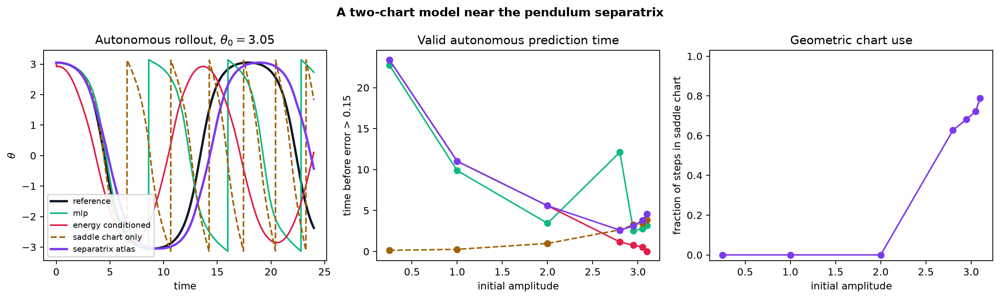

# Learned Koopman

[](https://github.com/joseph-crowley/learned-koopman/actions/workflows/ci.yml)
[](https://www.python.org/)
[](https://pytorch.org/)
[](LICENSE)

**A reproducible PyTorch study of a simple question with a sharp edge: can
learned linearizing coordinates remain useful when the pendulum approaches the
separatrix, where one global action-angle chart becomes singular?**

The project compares transparent physics and data-driven baselines with three
structured latent-dynamics models:

- a fixed, orthogonal Koopman autoencoder;
- an energy-conditioned rotation model that learns a different latent frequency
  on each invariant energy shell;
- a two-chart separatrix atlas that retains the rotation away from the saddle
  and switches to a learned hyperbolic chart near the unstable equilibrium.

The v2 result is useful and deliberately bounded. Across five seeds and held-out
amplitudes 2.95, 3.05, and 3.10, the atlas raises mean valid horizon to
**3.94 ± 0.06**, versus **3.27 ± 1.00** for the residual MLP and
**0.36 ± 0.12** for the single conditioned chart. It beats the MLP's
per-seed band average in **4 / 5** runs and preserves the single chart exactly
at ordinary energies. It still receives the analytic conserved energy, covers
libration below the separatrix rather than full rotations, and is not a claim
of a global finite-dimensional Koopman representation.



## One-command demonstration

Install [`uv`](https://docs.astral.sh/uv/), clone the repository, and run:

```bash
uv sync --extra dev
uv run learned-koopman demo --quick
```

The command generates deterministic trajectories, trains all learned models,
runs autonomous rollouts, and writes a figure plus machine-readable metrics.
It runs on CPU and does not require downloaded data.

Run the longer portfolio experiment with:

```bash
uv run learned-koopman benchmark
```

Probe sensitivity to initialization with three independent trained runs:

```bash
uv run learned-koopman robustness
```

Run the near-separatrix atlas and its five-seed falsification check:

```bash
uv run learned-koopman atlas
uv run learned-koopman atlas-robustness
```

## What v2 adds

The atlas experiment trains every learned baseline on the same denser amplitude
grid ending at 3.12, then evaluates complete held-out trajectories. Its
predeclared high-energy summary averages each seed over amplitudes 2.95, 3.05,
and 3.10 before comparing seeds:

| Model | Mean valid time over high-energy band | Variation across seeds | Band wins over MLP |
|---|---:|---:|---:|
| Residual MLP on atlas data | 3.27 | ± 1.00 | — |
| Single energy-conditioned chart | 0.36 | ± 0.12 | 0 / 5 |
| **Two-chart separatrix atlas** | **3.94** | **± 0.06** | **4 / 5** |

At the representative seed and amplitude 3.05, four ablations separate the
sources of improvement:

| Model or ablation | Valid time | Angle RMSE | Maximum energy drift |
|---|---:|---:|---:|
| Residual MLP | 2.76 | 1.346 | 0.891 |
| Single conditioned chart | 0.54 | 1.580 | 0.337 |
| Energy projection only | 0.02 | 1.580 | < 0.000001 |
| Saddle chart only | 3.48 | 1.348 | 3.876 |
| **Full atlas** | **3.82** | **0.817** | **< 0.000001** |

Projection alone does not repair the single chart, and the saddle chart alone
drifts badly. The result comes from using each simple dynamics law only where
its coordinates are appropriate, with transitions through the model's own
predicted physical state.

The original portfolio benchmark remains useful away from this targeted
high-energy experiment.

The representative seed-7 run at initial amplitude \(\theta_0=2.0\), evaluated
over a 24-unit autonomous rollout:

| Model | Parameters | Valid prediction time | Angle RMSE | Maximum energy drift |
|---|---:|---:|---:|---:|
| Persistence | 0 | 0.32 | 1.984 | 0.000 |
| Global DMD | 9 | 0.60 | 1.996 | 2.732 |
| Small-angle physics | 0 | 0.28 | 1.853 | 0.584 |
| Residual MLP | 2,691 | 3.30 | 0.535 | 0.202 |
| Fixed Koopman AE | 1,227 | 0.74 | 1.755 | 1.179 |
| **Energy-conditioned rotation** | **3,054** | **6.04** | **0.211** | **0.153** |

The exact parameter counts are recorded in
[`results/portfolio/metrics.json`](results/portfolio/metrics.json). The table
uses a valid-horizon threshold of
\(\sqrt{\Delta\theta^2 + 0.25\,\Delta\omega^2} > 0.15\).

The same comparison across seeds 7, 17, and 29 gives:

| Model | Mean valid time | Mean angle RMSE | Mean energy drift | Wins over the other neural model |
|---|---:|---:|---:|---:|
| Residual MLP | 5.74 ± 2.50 | 0.338 ± 0.158 | 0.170 ± 0.033 | 1 / 3 |
| Fixed Koopman AE | 0.72 ± 0.04 | 1.937 ± 0.134 | 1.293 ± 0.117 | — |
| **Energy-conditioned rotation** | **7.23 ± 1.86** | **0.218 ± 0.026** | 0.170 ± 0.028 | **2 / 3** |

These are means and population standard deviations over three runs, not
confidence intervals. Per-seed results and the aggregation contract are in
[`results/portfolio/robustness.json`](results/portfolio/robustness.json).

Four conclusions survive the stronger test:

1. Small-angle physics is superb where its assumptions hold and fails quickly
   at large amplitude.
2. The tested eight-dimensional fixed operator consistently underfits the
   continuum of nonlinear pendulum frequencies; this experiment does not prove
   that every fixed finite approximation must perform poorly.
3. Coordinate pretraining keeps the conditioned fit stable across all three
   runs. It improves the three-seed averages but does not beat a strong
   residual MLP on every initialization.
4. The single conditioned phase chart still breaks down near the separatrix;
   the v2 atlas repairs a meaningful part of that failure without claiming to
   solve rotation or the separatrix itself.

## Models

### Two-chart separatrix atlas

`SeparatrixAtlas` carries the learned energy-conditioned rotation as its regular
chart. In the high-energy neighborhood of the upright saddle it uses canonical
coordinates

\[
q=\operatorname{atan2}(-\sin\theta,-\cos\theta), \qquad p=\dot\theta
\]

and advances them with a learned symplectic hyperbolic operator:

\[
\begin{bmatrix}q'\\p'\end{bmatrix}
=
\begin{bmatrix}
\cosh(\lambda\Delta t) & \sinh(\lambda\Delta t)/\lambda\\
\lambda\sinh(\lambda\Delta t) & \cosh(\lambda\Delta t)
\end{bmatrix}
\begin{bmatrix}q\\p\end{bmatrix}.
\]

The chart index is an explicit geometric rule, not a black-box classifier:
use the saddle chart only for \(H>0.8\) and \(|q|<1.4\). The operator rate
\(\lambda\) is learned from the same training trajectories as the other
models. At high energy, predictions are projected back to the known invariant
energy shell. The projected single-chart and saddle-only ablations show that
neither ingredient is sufficient by itself.

An early neural-router variant was rejected during development because it
merely rediscovered this validity region and changed no routing decisions. The
smaller explicit rule is the stronger scientific model.

### Fixed Koopman autoencoder

The encoder and decoder are trained with reconstruction, latent-consistency,
and multistep rollout losses. Latent evolution is an orthogonal matrix generated
by a learned skew-symmetric matrix:

\[
z_{t+\Delta t} = \exp\!\left(\Delta t(G-G^\top)\right)z_t.
\]

This is a deliberately structured fixed-operator baseline. Orthogonality
prevents spectral-radius blow-up, while its finite fixed spectrum remains a
restrictive approximation to a continuum of pendulum frequencies.

### Energy-conditioned rotation

The structured model learns an action-angle phase coordinate and a frequency
law conditioned on the conserved energy:

\[
\phi_{t+\Delta t}
=R\!\left(\omega(H)\Delta t\right)\phi_t.
\]

Training first anchors the phase encoder and frequency network, then fits the
decoder and multistep physical rollout jointly. It uses the pendulum's exact
elliptic-integral frequency law as direct phase and frequency supervision.
Globally this is a **fibered family of linear operators**, not one finite
state-independent Koopman matrix. That boundary is important.

### Baselines

- persistence;
- the velocity-Verlet map of the linearized pendulum;
- global least-squares DMD on circular state coordinates;
- a matched-data residual MLP without a linear bottleneck.

## Reproducibility

- State: \((\sin\theta,\cos\theta,\dot\theta)\), respecting angle periodicity.
- Simulator: reversible, symplectic velocity Verlet.
- Split: complete evaluation trajectories at amplitudes absent from the
  training grid, never shuffled adjacent state pairs. The atlas experiment uses
  held-out 2.95, 3.05, and 3.10 trajectories near the separatrix.
- Seeds: 7 for the representative artifact; 7, 17, and 29 for the committed
  portfolio sensitivity check; and 7, 17, 29, 41, and 53 for the atlas. Each
  model receives an independent, identically seeded data-loader shuffle so
  training order cannot change another model's result.
- Outputs: environment versions, parameter counts, final losses, and every
  per-amplitude metric are written to JSON. Atlas results additionally report
  chart use, transitions, boundary disagreement, and held-out local-chart
  residuals.
- Checks:

  ```bash
  uv run ruff check .
  uv run pytest
  uv run python scripts/check_portfolio_results.py
  uv run python scripts/check_atlas_results.py
  uv run python scripts/check_run_health.py results/portfolio/metrics.json
  uv run python scripts/check_atlas_run_health.py results/atlas/metrics.json
  ```

The committed figure and metrics were produced by the repository's
`benchmark` command. See [Scientific scope](SCIENTIFIC_SCOPE.md) for the exact
claim boundary and [Architecture](ARCHITECTURE.md) for the implementation map.

## Project structure

```text
src/learned_koopman/
├── physics.py              # symplectic simulator and analytic frequency
├── data.py                 # trajectory windows and held-out amplitudes
├── models/
│   ├── baselines.py
│   ├── fixed_koopman.py
│   ├── energy_conditioned.py
│   └── separatrix_atlas.py
├── training.py             # explicit, model-specific objectives
├── evaluation.py           # autonomous rollouts and physical metrics
├── experiment.py           # reproducible artifacts
└── cli.py                  # one-command entrypoint
```

## Project history

This project began as a compact 2023 experiment around an encoder, learned
linear latent evolution, and decoder for pendulum dynamics. The original
prototype is preserved in
[`legacy/2023-prototype`](legacy/2023-prototype) and at the Git tag
`prototype-2023`.

The current edition returns to that idea with physics-grounded simulation,
autonomous rollout evaluation, reproducible benchmarks, and explicit
scientific scope.

## Prior art and context

Learned Koopman observables and linearly recurrent autoencoders predate this
project. Particularly relevant references are:

- [Takeishi et al.](https://arxiv.org/abs/1710.04340), *Learning Koopman
  Invariant Subspaces for Dynamic Mode Decomposition* (NeurIPS 2017);
- [Lusch, Kutz, and Brunton](https://doi.org/10.1038/s41467-018-07210-0),
  *Deep learning for universal linear embeddings of nonlinear dynamics*
  (Nature Communications 2018);
- [Otto and Rowley](https://doi.org/10.1137/18M1177846), *Linearly Recurrent
  Autoencoder Networks* (SIAM JADS 2019);
- [Azencot et al.](https://proceedings.mlr.press/v119/azencot20a.html),
  *Consistent Koopman Autoencoders* (ICML 2020).

Recent work on [Rigged DMD](https://epubs.siam.org/doi/10.1137/24M1662370)
and on the [limits of data-driven dynamical
learning](https://www.nature.com/articles/s41467-026-74220-8) reinforces the
project's claim discipline: continuous-frequency dynamics require more than
plausible eigenvalues, and finite learned representations need explicit
residuals and falsifiers.

This repository is a polished educational and experimental PyTorch project,
not a claim of a new universal Koopman theorem or state-of-the-art forecasting
system.

## License

[MIT](LICENSE)
