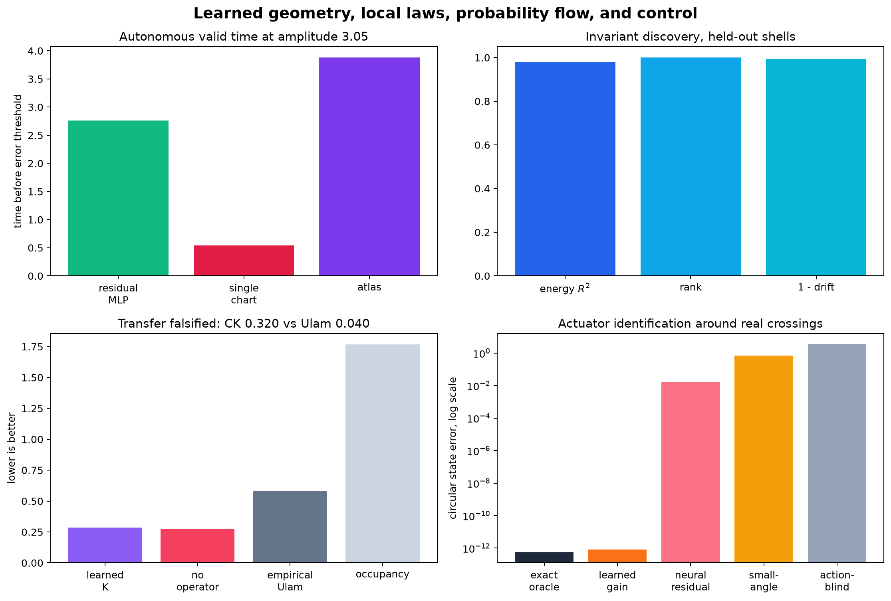
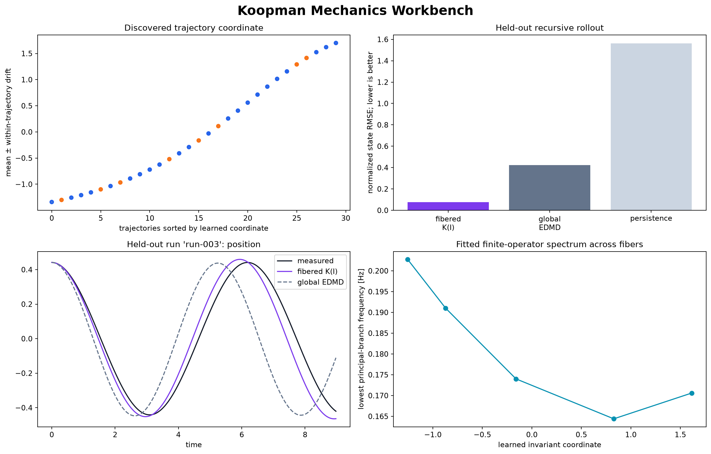

# Learned Koopman

[](https://github.com/joseph-crowley/learned-koopman/actions/workflows/ci.yml)
[](https://www.python.org/)
[](https://pytorch.org/)
[](LICENSE)

**Learn the invariants, local laws, and transitions that organize nonlinear
dynamics—without assuming one global linearization exists.**

Learned Koopman is a small, inspectable PyTorch project built around the
question of when nonlinear dynamics become simple in learned coordinates. It
now has two surfaces:

- a **mechanics workbench** that analyzes trajectory CSVs, discovers a
  candidate invariant, fits an invariant-conditioned Koopman family, certifies
  it on complete held-out trials, and exports a predictor;
- a **pendulum research lab** with local atlases, label-free invariants,
  stochastic transfer, and controlled crossings.

Every cell is runnable on CPU, writes machine-readable evidence, and carries a
direct physical check or matched falsifier. The point is not that pendulum
prediction is itself an unsolved application. The pendulum is small enough that
learned structure can be checked against known physics.



## Koopman mechanics workbench

The first engineer-facing path works on uniformly sampled, low-dimensional,
near-conservative mechanical trajectories:

```bash
uv run learned-koopman generate-example \
  --output examples/my-duffing.csv

uv run learned-koopman analyze examples/my-duffing.csv \
  --state-columns position velocity \
  --reference-column energy \
  --quick \
  --output results/my-duffing
```

The optional `energy` column is withheld from training and used only for a
post-hoc scientific check. For a real dataset, omit it:

```bash
uv run learned-koopman analyze measurements.csv \
  --trajectory-column trial_id \
  --time-column time \
  --state-columns position velocity \
  --output results/my-rig
```

The committed 30-trajectory, deterministic seed-7 Duffing run learns a stable scalar coordinate
(held-out normalized drift **0.0024**) that perfectly ranks the unseen energy
levels. Its invariant-conditioned quadratic Koopman family reaches held-out
recursive rollout RMSE **0.076**, versus **0.424** for global quadratic EDMD and **1.564**
for persistence. Those are complete held-out trajectories, conditioned only on
each initial state—not shuffled one-step pairs or future trajectory averages.



The committed [human report](results/mechanics-workbench/report.html),
[machine-readable manifest](results/mechanics-workbench/manifest.json), and
loadable model come from the public command above. Prediction requires a
positive fit certificate and checks both the fitted invariant range and
nearest-sampled-state distance before rollout:

```bash
uv run learned-koopman predict results/my-duffing/model.pt \
  --initial 1.2 0.0 \
  --steps 300 \
  --output results/my-duffing/prediction.csv
```

The mathematical theory, data contract, current-source landscape, product
architecture, and next research stages are in
[`PHYSICS_WORKBENCH.md`](PHYSICS_WORKBENCH.md).

## One-command demonstration

Install [`uv`](https://docs.astral.sh/uv/), clone the repository, and run:

```bash
git clone https://github.com/joseph-crowley/learned-koopman.git
cd learned-koopman
uv sync --extra dev
uv run learned-koopman lab --quick
```

The command trains and evaluates all four experiment cells, writes an overview
figure, and validates a single manifest at
`results/research-lab-quick/manifest.json`. It needs no downloaded data and
does not overwrite the committed full evidence.

Run the full promoted experiment with:

```bash
uv run learned-koopman lab
uv run python scripts/check_research_lab.py
```

Each cell is also independently useful:

```bash
uv run learned-koopman invariant --quick
uv run learned-koopman transfer --quick
uv run learned-koopman control --quick
uv run learned-koopman atlas --quick
```

Run the longer portfolio experiment with:

```bash
uv run learned-koopman benchmark
```

Probe sensitivity to initialization with three independent trained runs:

```bash
uv run learned-koopman robustness
```

Run the near-separatrix atlas and its five-seed falsification check:

```bash
uv run learned-koopman atlas
uv run learned-koopman atlas-robustness
```

## The v3 research lab

The committed full run makes the project's current evidence easy to inspect:

| Experiment | What is learned | Full-run result | Honest boundary |
|---|---|---|---|
| Separatrix atlas | one local saddle rate; routing is explicit | [**3.98 ± 0.06** valid time](results/atlas/robustness.json) over the five-seed high-energy band; at most seven switches per rollout | energy, chart geometry, projection, hysteresis, and dwell are supplied |
| Invariant discovery | one scalar from grouped state trajectories | held-out energy \(R^2=0.979\), rank correlation \(=1.000\), normalized drift \(=0.0053\) over five seeds | noiseless libration-shell interpolation only |
| Stochastic transfer | soft memberships and a positive row-stochastic operator | constraints pass, but \(K\) is **falsified**: one-lag NLL **0.286** versus **0.276** with no operator; CK **0.320** versus Ulam **0.040** | one seed and train-only coarse states; valid probability structure is not useful dynamics |
| Controlled crossing | one scalar actuator gain | gain **0.35 → 1.000**; **9 / 12** real crossings; crossing-window error \(8.1\times10^{-13}\), at the supplied oracle floor | system identification under known controls, not policy learning or control novelty |

These are connected but deliberately not collapsed into one architecture. An
invariant, a deterministic local flow, a stochastic transfer operator, and a
controlled flow map obey different mathematics. The shared contribution is the
experiment discipline: simple learned objects, structural constraints, held-out
tests, and failure modes that remain visible.

The full single-run lab evidence is embedded in
[`results/research-lab/manifest.json`](results/research-lab/manifest.json).
The five-seed atlas evidence remains in
[`results/atlas/robustness.json`](results/atlas/robustness.json).
The scientific continuation and adjacent research fields are mapped in
[`RESEARCH_ROADMAP.md`](RESEARCH_ROADMAP.md).

## Separatrix atlas study

The atlas experiment trains every learned baseline on the same denser amplitude
grid ending at 3.12, then evaluates complete held-out trajectories. Its
predeclared high-energy summary averages each seed over amplitudes 2.95, 3.05,
and 3.10 before comparing seeds. The atlas reaches **3.98 ± 0.06**, versus
**3.27 ± 1.00** for the residual MLP and **0.36 ± 0.12** for the single chart:

| Model | Mean valid time over high-energy band | Variation across seeds | Band wins over MLP |
|---|---:|---:|---:|
| Residual MLP on atlas data | 3.27 | ± 1.00 | — |
| Single energy-conditioned chart | 0.36 | ± 0.12 | 0 / 5 |
| **Two-chart separatrix atlas** | **3.98** | **± 0.06** | **4 / 5** |

At the representative seed and amplitude 3.05, four ablations separate the
sources of improvement:

| Model or ablation | Valid time | Angle RMSE | Maximum energy drift |
|---|---:|---:|---:|
| Residual MLP | 2.76 | 1.346 | 0.891 |
| Single conditioned chart | 0.54 | 1.580 | 0.337 |
| Energy projection only | 0.02 | 1.580 | < 0.000001 |
| Saddle chart only | 3.48 | 1.348 | 3.876 |
| **Full atlas** | **3.88** | **0.788** | **< 0.000001** |

Projection alone does not repair the single chart, and the saddle chart alone
drifts badly. The result comes from using each simple dynamics law only where
its coordinates are appropriate, with transitions through the model's own
predicted physical state. Exit hysteresis and a 12-step minimum dwell now remove
the severe boundary chatter found in two earlier seeded runs: the worst cases
fell from hundreds of switches to at most seven, with no rapid reversals.

The original portfolio benchmark remains useful away from this targeted
high-energy experiment.

The representative seed-7 run at initial amplitude \(\theta_0=2.0\), evaluated
over a 24-unit autonomous rollout:

| Model | Parameters | Valid prediction time | Angle RMSE | Maximum energy drift |
|---|---:|---:|---:|---:|
| Persistence | 0 | 0.32 | 1.984 | 0.000 |
| Global DMD | 9 | 0.60 | 1.996 | 2.732 |
| Small-angle physics | 0 | 0.28 | 1.853 | 0.584 |
| Residual MLP | 2,691 | 3.30 | 0.535 | 0.202 |
| Fixed Koopman AE | 1,227 | 0.74 | 1.755 | 1.179 |
| **Energy-conditioned rotation** | **3,054** | **6.04** | **0.211** | **0.153** |

The exact parameter counts are recorded in
[`results/portfolio/metrics.json`](results/portfolio/metrics.json). The table
uses a valid-horizon threshold of
\(\sqrt{\Delta\theta^2 + 0.25\,\Delta\omega^2} > 0.15\).

The same comparison across seeds 7, 17, and 29 gives:

| Model | Mean valid time | Mean angle RMSE | Mean energy drift | Wins over the other neural model |
|---|---:|---:|---:|---:|
| Residual MLP | 5.74 ± 2.50 | 0.338 ± 0.158 | 0.170 ± 0.033 | 1 / 3 |
| Fixed Koopman AE | 0.72 ± 0.04 | 1.937 ± 0.134 | 1.293 ± 0.117 | — |
| **Energy-conditioned rotation** | **7.23 ± 1.86** | **0.218 ± 0.026** | 0.170 ± 0.028 | **2 / 3** |

These are means and population standard deviations over three runs, not
confidence intervals. Per-seed results and the aggregation contract are in
[`results/portfolio/robustness.json`](results/portfolio/robustness.json).

Four conclusions survive the stronger test:

1. Small-angle physics is superb where its assumptions hold and fails quickly
   at large amplitude.
2. The tested eight-dimensional fixed operator consistently underfits the
   continuum of nonlinear pendulum frequencies; this experiment does not prove
   that every fixed finite approximation must perform poorly.
3. Coordinate pretraining keeps the conditioned fit stable across all three
   runs. It improves the three-seed averages but does not beat a strong
   residual MLP on every initialization.
4. The single conditioned phase chart still breaks down near the separatrix;
   the v2 atlas repairs a meaningful part of that failure without claiming to
   solve rotation or the separatrix itself.

## Models

### Label-free invariant discovery

`LearnedInvariant` maps the circular physical state to one scalar. Its training
objective only sees grouped trajectory states. It reduces variation along each
trajectory, fixes the variance across trajectory means to prevent a constant
solution, and uses a trajectory-set neighbor graph for smoothness. Energy,
amplitude ordering, phase, and frequency never enter training.

The exact Hamiltonian is used only after optimization to ask whether the
learned quotient coordinate organizes held-out shells. The coordinate is
fundamentally identifiable only up to a smooth monotone reparameterization, so
the evaluation reports rank and post-hoc affine alignment as well as
within-trajectory drift.

### Stochastic simplex transfer operator

`SimplexTransferOperator` encodes state as non-negative memberships that sum to
one. A row-wise softmax makes its transition matrix positive and
mass-preserving by construction:

\[
\chi(x_{t+\tau}) \approx \chi(x_t)K,\qquad
K_{ij}>0,\quad \sum_j K_{ij}=1.
\]

The training objective is categorically coherent: coarse-state
classification, one-lag negative log likelihood, and two-lag negative log
likelihood. The data come from a damped pendulum with Gaussian process noise in
the velocity equation. Independent stochastic branches from identical states
verify that the uncertainty is physical, not decoder noise.

The probability constraints work; the learned propagation does not. At one lag,
\(\chi(x_t)K\) has NLL 0.286 versus 0.276 for the learned membership with no
propagation. At two lags \(K^2\) improves over both no propagation and a direct
Ulam estimate. At the stochastic branching horizon, however, it loses to Ulam
and occupancy, and its Chapman–Kolmogorov residual is 0.320 versus Ulam's 0.040.
A mechanically derived `operator_verdict` therefore marks this profile
`falsified_by_current_profile`.

This is still a useful result: it recovers the original simplex idea with valid
mathematics and shows that positivity and mass preservation are necessary but
not sufficient for a useful transfer operator.

### Torque-conditioned crossing model

`GainOnlyControlledPendulum` uses the known conservative force as a grey-box
backbone and identifies one scalar actuator gain from 0.35 to 0.9999999. Its
recursive rollout receives the known torque at each step but no future true
states. The controlled kick-drift-kick simulator audits external work and
contains genuine \(H<1\) to \(H\ge1\) events; replaying the same initial states
with zero torque produces none.

An `ExactUnitGainOracle` exposes the numerical floor. The identified model
matches it on all crossing events. A higher-capacity
`ActionConditionedPendulum` with a neural residual is retained as an ablation
and is substantially worse, as are controlled small-angle physics and the same
identified model with its action channel zeroed.

This is a clean PyTorch system-identification exercise and forced-crossing
dataset, not a new control method. The next result must infer richer unknown
physics or close the loop against energy shaping, EDMDc, and nonlinear MPC.

### Two-chart separatrix atlas

`SeparatrixAtlas` carries the learned energy-conditioned rotation as its regular
chart. In the high-energy neighborhood of the upright saddle it uses canonical
coordinates

\[
q=\operatorname{atan2}(-\sin\theta,-\cos\theta), \qquad p=\dot\theta
\]

and advances them with a learned symplectic hyperbolic operator:

\[
\begin{bmatrix}q'\\p'\end{bmatrix}
=
\begin{bmatrix}
\cosh(\lambda\Delta t) & \sinh(\lambda\Delta t)/\lambda\\
\lambda\sinh(\lambda\Delta t) & \cosh(\lambda\Delta t)
\end{bmatrix}
\begin{bmatrix}q\\p\end{bmatrix}.
\]

The chart index is an explicit geometric rule, not a black-box classifier:
enter the saddle chart for \(H>0.8\) and \(|q|<1.4\), remain there until
\(|q|\ge1.5\), and require a 12-step dwell after switching. The operator rate
\(\lambda\) is learned from the same training trajectories as the other models.
At high energy, predictions are projected back to the known invariant energy
shell. The projected single-chart and saddle-only ablations show that neither
ingredient is sufficient by itself.

The current ablations do not establish that the fitted scalar rate is necessary
or optimal; an analytic saddle rate is a strong alternative. The demonstrated
gain is therefore attributed to the hand-structured atlas as a whole, not to
learning \(\lambda\) in isolation.

An early neural-router variant was rejected during development because it
merely rediscovered this validity region and changed no routing decisions. The
smaller explicit rule is the stronger scientific model.

### Fixed Koopman autoencoder

The encoder and decoder are trained with reconstruction, latent-consistency,
and multistep rollout losses. Latent evolution is an orthogonal matrix generated
by a learned skew-symmetric matrix:

\[
z_{t+\Delta t} = \exp\!\left(\Delta t(G-G^\top)\right)z_t.
\]

This is a deliberately structured fixed-operator baseline. Orthogonality
prevents spectral-radius blow-up, while its finite fixed spectrum remains a
restrictive approximation to a continuum of pendulum frequencies.

### Energy-conditioned rotation

The structured model learns an action-angle phase coordinate and a frequency
law conditioned on the conserved energy:

\[
\phi_{t+\Delta t}
=R\!\left(\omega(H)\Delta t\right)\phi_t.
\]

Training first anchors the phase encoder and frequency network, then fits the
decoder and multistep physical rollout jointly. It uses the pendulum's exact
elliptic-integral frequency law as direct phase and frequency supervision.
Globally this is a **fibered family of linear operators**, not one finite
state-independent Koopman matrix. That boundary is important.

### Baselines

- persistence;
- the velocity-Verlet map of the linearized pendulum;
- global least-squares DMD on circular state coordinates;
- a matched-data residual MLP without a linear bottleneck.

## Reproducibility

- State: \((\sin\theta,\cos\theta,\dot\theta)\), respecting angle periodicity.
- Simulator: reversible, symplectic velocity Verlet.
- Split: complete evaluation trajectories at amplitudes absent from the
  training grid, never shuffled adjacent state pairs. The atlas experiment uses
  held-out 2.95, 3.05, and 3.10 trajectories near the separatrix.
- Seeds: 7 for the representative artifact; 7, 17, and 29 for the committed
  portfolio sensitivity check; and 7, 17, 29, 41, and 53 for the atlas. Each
  model receives an independent, identically seeded data-loader shuffle so
  training order cannot change another model's result.
- Outputs: environment versions, parameter counts, final losses, and every
  per-amplitude metric are written to JSON. Atlas results additionally retain
  the full route trace, switch locations, chatter diagnostics, chart use,
  boundary disagreement, and held-out local-chart residuals. The integrated lab
  manifest carries every component result plus a compact summary and claim
  boundary.
- Checks:

  ```bash
  uv run ruff check .
  uv run pytest
  uv run python scripts/check_workbench.py
  uv run python scripts/check_research_lab.py
  uv run python scripts/check_portfolio_results.py
  uv run python scripts/check_atlas_results.py
  uv run python scripts/check_run_health.py results/portfolio/metrics.json
  uv run python scripts/check_atlas_run_health.py results/atlas/metrics.json
  ```

The committed workbench and research-lab artifacts were produced by their
public CLI commands. See [Scientific scope](SCIENTIFIC_SCOPE.md) for the exact
claim boundary and [Architecture](ARCHITECTURE.md) for the implementation map.

## Project structure

```text
src/learned_koopman/
├── physics.py               # autonomous simulator and physical metrics
├── control.py               # controlled simulator and action model
├── data.py                  # deterministic trajectory windows
├── trajectory.py            # external trajectory CSV contract
├── operator_family.py       # invariant-conditioned Koopman regressions
├── workbench.py             # fit, certificate, report, export, predict
├── models/
│   ├── baselines.py         # transparent prediction baselines
│   ├── fixed_koopman.py     # one fixed latent operator
│   ├── energy_conditioned.py
│   ├── separatrix_atlas.py  # stateful local-chart routing
│   ├── invariant.py         # label-free scalar coordinate
│   └── transfer.py          # simplex transfer operator
├── invariant_experiment.py
├── transfer_experiment.py
├── control_experiment.py
├── research_lab.py          # integrated run, figure, and validator
├── training.py
├── evaluation.py
├── experiment.py
└── cli.py
```

## Project lineage and research program

Learned Koopman began in 2023 with a broad question: can a learned latent
representation turn nonlinear pendulum motion into simple evolution under a
learned operator? The first prototype combined an encoder, a Gumbel-simplex
latent state, linear latent evolution, and a decoder across many initial
conditions. It was an exploratory implementation, but it established the
research direction that still drives this repository.

The current edition turns that question into a sequence of falsifiable
experiments. The fixed model tests whether one global operator is enough.
Energy conditioning shows that an invariant can index a family of simple local
flows. The atlas demonstrates why a coordinate singularity needs a second local
law. The invariant, transfer, and controlled-crossing cells now recover the
prototype's broader discovery, probabilistic, and full-phase-space ambitions
with explicit mathematical contracts.

The untouched snapshot is preserved in
[`legacy/2023-prototype`](legacy/2023-prototype) and at the Git tag
`prototype-2023`. It records the original question; the active package supplies
the physics, autonomous evaluation, reproducibility, and claim boundaries
needed to answer it.

## Prior art and context

Learned Koopman observables and linearly recurrent autoencoders predate this
project. Particularly relevant references are:

- [Takeishi et al.](https://arxiv.org/abs/1710.04340), *Learning Koopman
  Invariant Subspaces for Dynamic Mode Decomposition* (NeurIPS 2017);
- [Lusch, Kutz, and Brunton](https://doi.org/10.1038/s41467-018-07210-0),
  *Deep learning for universal linear embeddings of nonlinear dynamics*
  (Nature Communications 2018);
- [Otto and Rowley](https://doi.org/10.1137/18M1177846), *Linearly Recurrent
  Autoencoder Networks* (SIAM JADS 2019);
- [Azencot et al.](https://proceedings.mlr.press/v119/azencot20a.html),
  *Consistent Koopman Autoencoders* (ICML 2020).

Recent work on [Rigged DMD](https://epubs.siam.org/doi/10.1137/24M1662370)
and on the [limits of data-driven dynamical
learning](https://www.nature.com/articles/s41467-026-74220-8) reinforces the
project's claim discipline: continuous-frequency dynamics require more than
plausible eigenvalues, and finite learned representations need explicit
residuals and falsifiers.

Multi-chart autoencoders, Hamiltonian neural models, conservation-law
discovery, stochastic transfer operators, and Koopman control also predate this
repository. The project does not claim those templates as new. Its useful
research direction is their combination around failure modes: invariant-indexed
dynamics, local structure near singular transitions, conservative probability
flow, and controlled crossings. The prior-art map and concrete novelty ladder
are in [`RESEARCH_ROADMAP.md`](RESEARCH_ROADMAP.md).

This is a polished experimental PyTorch project with several promising research
continuations, not a claim of a new theorem or state-of-the-art forecasting
system.

## License

[MIT](LICENSE)
