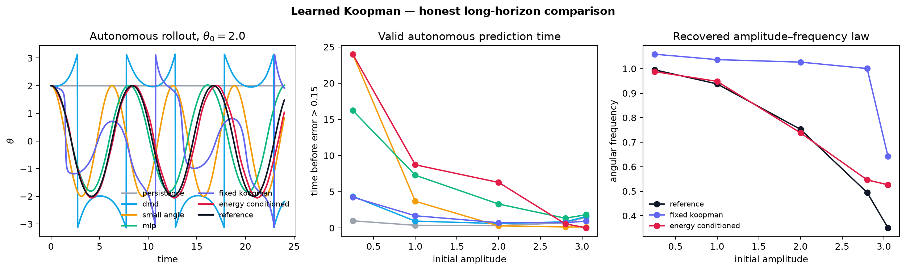

# Learned Koopman

[](https://github.com/joseph-crowley/learned-koopman/actions/workflows/ci.yml)
[](https://www.python.org/)
[](https://pytorch.org/)
[](LICENSE)

**A reproducible PyTorch study of a simple question with a sharp edge: can a
neural network learn coordinates that make nonlinear pendulum dynamics easy to
evolve?**

The project compares transparent physics and data-driven baselines with two
latent-dynamics models:

- a fixed, orthogonal Koopman autoencoder;
- an energy-conditioned rotation model that learns a different latent frequency
  on each invariant energy shell.

The result is intentionally honest. Energy conditioning helps in the nonlinear
libration regime, one fixed latent operator cannot represent the
amplitude-dependent frequency, and every learned model deteriorates near the
separatrix. The failure is part of the demonstration.



## One-command demonstration

Install [`uv`](https://docs.astral.sh/uv/), clone the repository, and run:

```bash
uv sync --extra dev
uv run learned-koopman demo --quick
```

The command generates deterministic trajectories, trains all learned models,
runs autonomous rollouts, and writes a figure plus machine-readable metrics.
It runs on CPU and does not require downloaded data.

Run the longer portfolio experiment with:

```bash
uv run learned-koopman benchmark
```

## What the benchmark shows

At initial amplitude \(\theta_0=2.0\), evaluated over a 24-unit autonomous
rollout:

| Model | Parameters | Valid prediction time | Angle RMSE | Maximum energy drift |
|---|---:|---:|---:|---:|
| Persistence | 0 | 0.32 | 1.984 | 0.000 |
| Global DMD | 9 | 0.60 | 1.996 | 2.732 |
| Small-angle physics | 0 | 0.28 | 1.853 | 0.584 |
| Residual MLP | 2,691 | 3.30 | 0.535 | 0.202 |
| Fixed Koopman AE | 1,227 | 0.72 | 1.758 | 1.179 |
| **Energy-conditioned rotation** | **3,054** | **6.28** | **0.264** | **0.143** |

The exact parameter counts are recorded in
[`results/portfolio/metrics.json`](results/portfolio/metrics.json). The table
uses a valid-horizon threshold of
\(\sqrt{\Delta\theta^2 + 0.25\,\Delta\omega^2} > 0.15\).

Three conclusions survive the test:

1. Small-angle physics is superb where its assumptions hold and fails quickly
   at large amplitude.
2. A single fixed latent frequency is the wrong global model for the nonlinear
   pendulum.
3. Energy conditioning recovers the amplitude–frequency curve through the
   nonlinear libration regime, but its single phase chart breaks down near the
   separatrix. A multi-chart model is the natural next experiment.

## Models

### Fixed Koopman autoencoder

The encoder and decoder are trained with reconstruction, latent-consistency,
and multistep rollout losses. Latent evolution is an orthogonal matrix generated
by a learned skew-symmetric matrix:

\[
z_{t+\Delta t} = \exp\!\left(\Delta t(G-G^\top)\right)z_t.
\]

This is a deliberately strong fixed-operator baseline. Orthogonality prevents
spectral-radius blow-up; it does not solve the continuum of pendulum
frequencies.

### Energy-conditioned rotation

The structured model learns an action-angle phase coordinate and a frequency
law conditioned on the conserved energy:

\[
\phi_{t+\Delta t}
=R\!\left(\omega(H)\Delta t\right)\phi_t.
\]

Training uses the pendulum's exact elliptic-integral frequency law as phase and
frequency supervision. Globally this is a **fibered family of linear
operators**, not one finite state-independent Koopman matrix. That boundary is
important.

### Baselines

- persistence;
- the velocity-Verlet map of the linearized pendulum;
- global least-squares DMD on circular state coordinates;
- a matched-data residual MLP without a linear bottleneck.

## Reproducibility

- State: \((\sin\theta,\cos\theta,\dot\theta)\), respecting angle periodicity.
- Simulator: reversible, symplectic velocity Verlet.
- Split: complete held-out amplitude trajectories, never shuffled adjacent
  state pairs.
- Seed: fixed in the experiment configuration.
- Outputs: environment versions, parameter counts, final losses, and every
  per-amplitude metric are written to JSON.
- Checks:

  ```bash
  uv run ruff check .
  uv run pytest
  uv run python scripts/check_portfolio_results.py
  ```

The committed figure and metrics were produced by the repository's
`benchmark` command. See [Scientific scope](SCIENTIFIC_SCOPE.md) for the exact
claim boundary and [Architecture](ARCHITECTURE.md) for the implementation map.

## Project structure

```text
src/learned_koopman/
├── physics.py              # symplectic simulator and analytic frequency
├── data.py                 # trajectory windows and held-out amplitudes
├── models/
│   ├── baselines.py
│   ├── fixed_koopman.py
│   └── energy_conditioned.py
├── training.py             # explicit, model-specific objectives
├── evaluation.py           # autonomous rollouts and physical metrics
├── experiment.py           # reproducible artifacts
└── cli.py                  # one-command entrypoint
```

## Where this came from

The repository began as a compact 2023 experiment combining an encoder, a
linear latent layer, and a decoder. That version contained a broken filename
contract, an inconsistent categorical/Gaussian latent objective, and a
teacher-forced small-angle test.

It is preserved in [`legacy/2023-prototype`](legacy/2023-prototype) and at the
Git tag `prototype-2023`. The portfolio edition keeps the original creative
instinct while making the software, objective, evaluation, and claims
defensible.

## Prior art and context

Learned Koopman observables and linearly recurrent autoencoders predate this
project. Particularly relevant references are:

- Takeishi et al., *Learning Koopman Invariant Subspaces for Dynamic Mode
  Decomposition* (NeurIPS 2017);
- Lusch, Kutz, and Brunton, *Deep learning for universal linear embeddings of
  nonlinear dynamics* (Nature Communications 2018);
- Otto and Rowley, *Linearly Recurrent Autoencoder Networks* (SIAM JADS 2019);
- Azencot et al., *Consistent Koopman Autoencoders* (ICML 2020).

This repository is a polished educational and experimental PyTorch project, not
a claim of a new universal Koopman theorem or state-of-the-art forecasting
system.

## License

[MIT](LICENSE)
